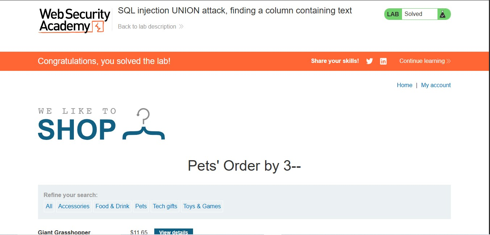
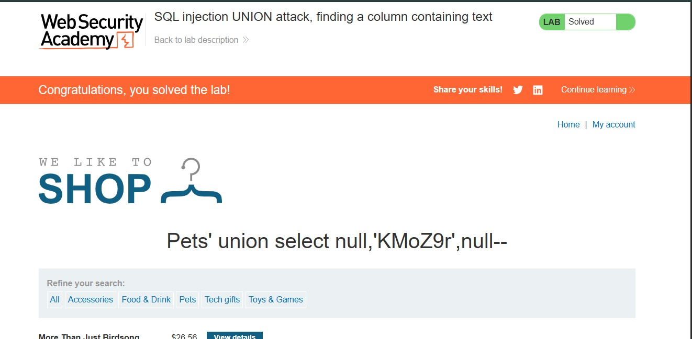

# SQL Injection UNION Attack: Finding a Column Containing Text

## Lab Overview

**Level:** PRACTITIONER  
**Status:** ✅ Solved  
**Objective:** Perform a SQL injection UNION attack to return an additional row containing a specific string value by identifying which columns are compatible with string data.

## Vulnerability Details

The application contains a SQL injection vulnerability in the **product category filter**. The results from the database query are reflected directly in the application's response, allowing us to use a UNION-based attack to retrieve data from other tables.

**Target:** Product category filter  
**Selected Category:** Pets  
**Random Value to Extract:** KMoZ9r

## Solution Steps

### Step 1: Determine the Number of Columns

First, we need to find out how many columns are returned by the original query. This is done using the `ORDER BY` technique to probe different column numbers.

**Payload:**
```sql
' ORDER BY 3--
```

**Process:**
- We append `' ORDER BY 1--` to test if 1 column exists
- Increment the number until the query fails
- This tells us the exact number of columns in the original query

**Result:** The query succeeds with 3 columns, meaning the original query returns exactly **3 columns**.



### Step 2: Identify Columns Compatible with String Data

Now we know there are 3 columns. We need to determine which columns can hold string data by crafting a UNION SELECT statement.

**Initial Test Payload:**
```sql
' UNION SELECT null,null,null--
```

This tests if a UNION statement is possible and checks the data types. We use `null` initially because null is compatible with any data type.

**Refined Payload:**
```sql
' UNION SELECT null,'KMoZ9r',null--
```

**Execution:**
- Column 1: `null` (unknown data type from original query)
- Column 2: `'KMoZ9r'` (string literal test)
- Column 3: `null` (unknown data type from original query)

**Result:** The query executes successfully with the string value appearing in the results, indicating that **Column 2 is compatible with string data**.



## Lab Completion

The lab is successfully solved when:
- ✅ The number of columns in the original query is correctly identified (3 columns)
- ✅ A column compatible with string data is identified (Column 2)
- ✅ The injected string value 'KMoZ9r' appears in the query results

## Key Concepts Learned

1. **UNION Attack Basics:** UNION statements allow us to combine results from multiple SELECT queries, provided they have the same number of columns.

2. **Column Discovery:** The `ORDER BY` technique is the most reliable way to determine the number of columns in a query:
   - If `ORDER BY n` succeeds, there are at least n columns
   - If it fails, there are fewer than n columns

3. **Data Type Detection:** By testing different data types (null, numbers, strings) in UNION SELECT statements, we can identify which columns accept string data.

4. **Exploitation Chain:**
   - Find column count → Identify string-compatible columns → Extract sensitive data

## Payloads Summary

| Step | Payload | Purpose |
|------|---------|---------|
| 1 | `' ORDER BY 3--` | Determine number of columns |
| 2 | `' UNION SELECT null,'KMoZ9r',null--` | Identify string-compatible column |

## Security Implications

This vulnerability demonstrates:
- The importance of parameterized queries and prepared statements
- Why input validation alone is insufficient
- How attackers can enumerate database structure and extract data
- The danger of reflecting query results directly in application responses

## Remediation

1. Use **prepared statements** with parameterized queries
2. Implement **input validation** and sanitization
3. Apply **principle of least privilege** to database accounts
4. Use **Web Application Firewalls (WAF)** to detect UNION-based attacks
5. Implement **error handling** to avoid exposing SQL error messages
